<div align="center">

# 🌟 Hey there, I'm Oussama El Boukhari 🌟

[](https://git.io/typing-svg)


[](https://github.com/oussama-username)
[](https://github.com/oussama-username)
[](https://github.com/oussama-username)

</div>

---

## 🧠 About Me

```typescript
const oussama = {
    location: "Morocco 🇲🇦",
    education: "1337 School (42 Network)",
    currentFocus: "System Programming & Full-Stack Development",
    languages: ["Arabic", "French", "English"],
    askMeAbout: ["C/C++", "Web Development", "System Design", "Problem Solving"],
    technologies: {
        lowLevel: ["C", "C++", "Assembly", "Linux Systems"],
        backend: ["Node.js", "Python", "Express", "MongoDB", "MySQL"],
        frontend: ["React", "TypeScript", "HTML5", "CSS3", "JavaScript"],
        tools: ["Git", "Docker", "Bash", "Vim", "VS Code"],
        currentlyLearning: ["Rust", "Go", "DevOps", "Cloud Architecture"]
    },
    funFact: "I debug C code at 3 AM and call it fun! 🐛✨"
};
```

<div align="center">

## 🛠️ Tech Arsenal

### 💾 Low-Level & Systems


### 🌐 Web Development


### 🗄️ Databases & Tools


</div>

---

<div align="center">

## 📊 GitHub Analytics


</div>

---

## 🚀 Featured Projects

<div align="center">

| 🏆 Project | 📝 Description | 🔗 Links | ⭐ Stars |
|------------|----------------|-----------|----------|
| **🔥 Real-Time Chat Engine** | WebSocket-powered chat with React frontend & Node.js backend | [🌠Live](https://your-demo.com) • [📠Code](https://github.com/your-repo) |  |
| **🚠Custom Unix Shell** | Feature-complete shell with pipes, redirections & signal handling | [📠Code](https://github.com/your-repo) • [📖 Docs](https://your-docs.com) |  |
| **🳠Mini Container Runtime** | Lightweight containerization system built from scratch in C | [📠Code](https://github.com/your-repo) • [🥠Demo](https://your-video.com) |  |
| **🮠3D Ray-Tracing Engine** | Real-time 3D renderer with custom algorithms | [🮠Play](https://your-game.com) • [📠Code](https://github.com/your-repo) |  |

</div>

---

<div align="center">

## 🎯 Current Focus

```mermaid
graph TD
    A[🎯 Current Goals] --> B[🦀 Learning Rust]
    A --> C[☁️ Cloud Architecture]
    A --> D[🔧 DevOps Pipeline]
    A --> E[🚀 Open Source Contribution]
    
    B --> F[System Programming]
    C --> G[AWS/Docker Mastery]
    D --> H[CI/CD Automation]
    E --> I[Community Impact]
```



</div>

---

## 🌍 Connect & Collaborate

<div align="center">

[](mailto:oussama.elboukhari@example.com)
[](https://linkedin.com/in/oussama-elboukhari)
[](https://oussama-portfolio.com)
[](https://twitter.com/oussama_dev)

</div>

---

<div align="center">

## 💭 Philosophy

> *"Code is poetry written in logic. Every bug is a verse waiting to be perfected."*

### 🧠 What Drives Me
- **Problem Solving**: Love tackling complex algorithmic challenges
- **System Design**: Fascinated by how large-scale systems work
- **Code Quality**: Believer in clean, maintainable, and efficient code
- **Learning**: Always curious about emerging technologies

### 🎯 2024 Goals
- [ ] Contribute to major open-source projects
- [ ] Master cloud-native development
- [ ] Build a system programming framework
- [ ] Mentor aspiring developers

</div>

---

<div align="center">

## 🏆 Achievements & Certifications

[](https://42.fr)
[](https://hackerrank.com/oussama)
[](https://leetcode.com/oussama)

### 📈 Coding Stats


</div>

---

<div align="center">

## ⚡ Fun Zone


### 🎲 Random Dev Joke


### 🎵 Coding Soundtrack
Currently vibing to: **Lo-fi Hip Hop** 🎧 *(Perfect for debugging sessions)*

### 🌟 Quote of the Day


</div>

---

<div align="center">

*"Building the future, one commit at a time"* ✨

[](https://github.com/oussama-username)
[](https://github.com/oussama-username)

**Thanks for visiting! Let's build something amazing together** 🚀

 <em><b>Happy coding!</b></em> 

</div>
